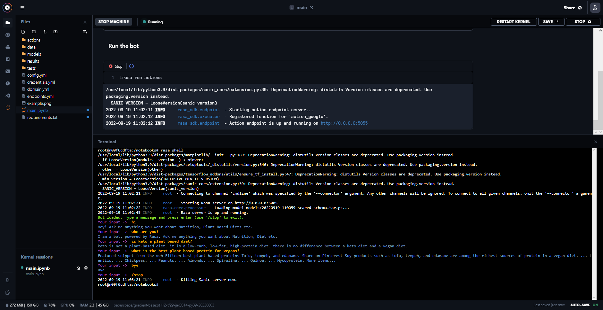

## Instructions (HowTo)
The following notebook creates and trains a new RASA bot that can answer questions based on the FAQ spreadsheet here.  
In order to talk to this bot follow these instructions:
1. Run all cells in this notebook
2. Create a new Terminal window
3. Run command `rasa shell` and follow the onscreen instructions
4. You can now talk to the bot via the command line interface

**Example of running the bot**
